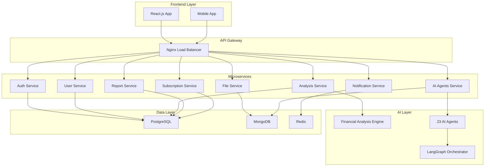

# 🚀 FinClick.AI - منصة التحليل المالي الذكية

<div align="center">


**المنصة الأولى للتحليل المالي المدعومة بالذكاء الاصطناعي في منطقة الشرق الأوسط**

[](https://opensource.org/licenses/MIT)
[](https://docker.com)
[](https://openai.com)
[](#)

[English](#english) | [العربية](#arabic)

</div>

---

# 🇸🇦 العربية <a id="arabic"></a>

## 📋 نظرة عامة

**FinClick.AI** هي منصة SaaS رائدة للتحليل المالي مدعومة بالذكاء الاصطناعي، تقدم **180 نوعاً من التحليل المالي** مع **23 وكيل ذكاء اصطناعي متخصص** يعملون معاً لتوفير تحليلات مالية شاملة ودقيقة في أقل من 30 ثانية.

### ✨ المميزات الرئيسية

- 🔢 **180 تحليل مالي شامل** موزعة على 3 فئات رئيسية
- 🤖 **23 وكيل ذكاء اصطناعي** متخصص مع تقنية LangGraph
- 🌍 **دعم ثنائي اللغة** (العربية والإنجليزية) مع RTL
- ⚡ **معالجة سريعة** - نتائج في أقل من 30 ثانية
- 📊 **تقارير احترافية** بصيغ PDF, Word, Excel, PowerPoint
- 💳 **4 خطط اشتراك** مرنة تناسب جميع الاحتياجات
- 🔐 **أمان متقدم** ومعايير IFRS
- ☁️ **نشر سحابي** مع Docker و Kubernetes

## 📊 أنواع التحليل المالي (180 تحليل)

### 🏗️ التحليلات الأساسية التأسيسية (106 تحليل)

#### 💧 تحليلات السيولة (15 تحليل)
- Current Ratio | Quick Ratio | Cash Ratio
- Operating Cash Flow Ratio | Cash Conversion Cycle
- Days Sales Outstanding (DSO) | Days Inventory Outstanding (DIO)
- Working Capital Analysis | Liquidity Index
- Defensive Interval Ratio | Cash Coverage Ratio

#### 💰 تحليلات الربحية (25 تحليل)
- Gross/Operating/Net Profit Margins | EBITDA Margin
- Return on Assets (ROA) | Return on Equity (ROE)
- Return on Investment (ROI) | Return on Capital Employed (ROCE)
- Earnings Per Share (EPS) | Price-to-Earnings (P/E)
- DuPont Analysis | Economic Value Added (EVA)
- Market Value Added (MVA) | Financial Leverage

#### ⚡ تحليلات الكفاءة (20 تحليل)
- Asset Turnover Ratios | Inventory Turnover
- Receivables/Payables Turnover | Working Capital Turnover
- Revenue per Employee | Customer Metrics
- Operating Cycle Analysis | Resource Utilization

#### 🏦 تحليلات الرافعة المالية (15 تحليل)
- Debt-to-Equity Ratio | Debt-to-Assets Ratio
- Interest Coverage Ratio | Times Interest Earned
- EBITDA Coverage Ratio | Capital Adequacy Ratio
- Fixed Charge Coverage | Financial Leverage Multiplier

#### 📈 تحليلات السوق والتقييم (15 تحليل)
- Price-to-Book (P/B) | Price-to-Sales (P/S)
- Enterprise Value to EBITDA | Market Capitalization
- Dividend Yield | Dividend Payout Ratio
- Tobin's Q Ratio | Book Value per Share

#### 🌱 تحليلات النمو (16 تحليل)
- Revenue/Net Income Growth Rates | EPS Growth
- Asset/Equity Growth | Working Capital Growth
- Sustainable Growth Rate | Internal Growth Rate
- EBITDA Growth | Free Cash Flow Growth

### ⚠️ تحليلات تقييم المخاطر (21 تحليل)

#### 💳 مخاطر الائتمان (7 تحليلات)
- Altman Z-Score | Credit Risk Ratio
- Default Probability | Credit Rating Analysis
- Bankruptcy Prediction | Financial Distress Indicator

#### 📊 مخاطر السوق (7 تحليلات)
- Beta Coefficient | Value at Risk (VaR)
- Market Risk Premium | Systematic Risk Analysis
- Volatility Analysis | Correlation Analysis

#### 🔧 المخاطر التشغيلية (7 تحليلات)
- Operating Leverage | Business Risk Assessment
- Supply Chain Risk | Technology Risk
- Human Capital Risk | Regulatory Compliance Risk

### 🏪 تحليلات السوق والصناعة (53 تحليل)

#### 💎 تحليل التقييم (13 تحليل)
- DCF Valuation | Comparable Companies Analysis
- Precedent Transactions | Asset-Based Valuation
- Sum-of-Parts Valuation | Dividend Discount Model
- Fair Value Assessment | Intrinsic Value Calculation

#### 🎯 تحليل السوق (10 تحليلات)
- Market Size/Growth Analysis | Market Share Analysis
- Market Penetration | Market Segmentation
- Target Market Analysis | Market Trends

#### 🥊 تحليل المنافسين (10 تحليلات)
- Competitive Positioning | Competitor Benchmarking
- Competitive Advantage | Market Leadership
- Competitive Landscape | Competitive Strategy

#### 🏭 تحليل الصناعة (10 تحليلات)
- Industry Overview | Industry Growth Trends
- Industry Lifecycle | Industry Profitability
- Regulatory Environment | Barriers to Entry

#### 📏 التحليل المقارن (10 تحليلات)
- Peer Group Analysis | Sector Comparison
- Performance Benchmarking | Efficiency Comparison
- Growth/Profitability Comparison

## 🤖 نظام الوكلاء الذكية (23 وكيل)

### 🔧 الوكلاء الأساسيين
1. **DataExtractionAgent** - استخراج ومعالجة البيانات من المستندات
2. **FinancialAnalysisAgent** - تنسيق جميع التحليلات المالية الـ106
3. **RiskAssessmentAgent** - تقييم شامل للمخاطر بـ21 نوع
4. **MarketAnalysisAgent** - تحليل السوق والصناعة بـ53 نوع
5. **ReportGenerationAgent** - إنتاج التقارير المهنية
6. **RecommendationAgent** - توليد التوصيات الاستراتيجية
7. **ValidationAgent** - ضمان الجودة والتحقق

### 🧠 الوكلاء المتخصصون
8. **ComplianceAgent** - التحقق من الامتثال للمعايير
9. **BenchmarkingAgent** - المقارنات المعيارية
10. **ForecastingAgent** - التنبؤات المالية
11. **ESGAnalysisAgent** - تحليل الاستدامة
12. **IndustryExpertAgent** - خبرة قطاعية متخصصة
13. **RegionalAnalysisAgent** - تحليل إقليمي
14. **TechnicalAnalysisAgent** - التحليل الفني للأسواق
15. **MacroeconomicAgent** - التحليل الاقتصادي الكلي

### 🔗 وكلاء التكامل والإدارة
16. **OrchestratorAgent** - تنسيق العمليات
17. **QualityAssuranceAgent** - ضمان الجودة
18. **DataValidationAgent** - التحقق من البيانات
19. **NotificationAgent** - إدارة الإشعارات
20. **SecurityAgent** - الأمان والحماية
21. **MonitoringAgent** - المراقبة والأداء
22. **IntegrationAgent** - التكامل مع الأنظمة الخارجية
23. **LearningAgent** - التعلم المستمر والتحسين

## 💎 خطط الاشتراك

| الخطة | السعر (شهرياً) | عدد التحليلات | المميزات |
|-------|----------------|----------------|----------|
| **مجاني** | $0 | 5 | تحليلات أساسية، تقارير PDF |
| **أساسي** | $29 | 50 | تحليلات متقدمة، تقارير متعددة |
| **متقدم** | $99 | 200 | جميع التحليلات، API access |
| **مؤسسي** | $299 | غير محدود | دعم مخصص، تكامل مؤسسي |

## 🚀 البدء السريع

### متطلبات النظام
- Docker & Docker Compose
- Node.js 18+ (للتطوير)
- Python 3.9+ (للتطوير)
- 8GB RAM (الحد الأدنى)
- 50GB storage

### 1. نسخ المشروع
```bash
git clone https://github.com/finclick-ai/platform.git
cd finclick-ai-platform
```

### 2. إعداد المتغيرات
```bash
cp .env.example .env
# قم بتعديل المتغيرات حسب بيئتك
```

### 3. تشغيل المنصة
```bash
# للتطوير
docker-compose -f docker-compose.dev.yml up -d

# للإنتاج
./scripts/deployment/deploy.sh production
```

### 4. الوصول للمنصة
- **الواجهة الأمامية**: http://localhost:3000
- **API Gateway**: http://localhost:8080
- **لوحة المراقبة**: http://localhost:3001

## 🏗️ معمارية النظام



## 📁 هيكل المشروع

```
FinClick.AI Platform/
├── 📁 frontend/                    # تطبيق React.js
│   ├── 📁 src/
│   │   ├── 📁 components/          # مكونات React
│   │   ├── 📁 pages/               # صفحات التطبيق
│   │   ├── 📁 hooks/               # React Hooks
│   │   └── 📁 i18n/                # الترجمة والتدويل
│   ├── 📄 package.json
│   └── 📄 Dockerfile
├── 📁 backend/                     # الخدمات المصغرة
│   ├── 📁 auth-service/            # خدمة المصادقة
│   ├── 📁 user-service/            # خدمة المستخدمين
│   ├── 📁 file-service/            # خدمة الملفات
│   ├── 📁 analysis-service/        # خدمة التحليل
│   ├── 📁 ai-agents-service/       # خدمة الوكلاء الذكية
│   ├── 📁 reporting-service/       # خدمة التقارير
│   ├── 📁 subscription-service/    # خدمة الاشتراكات
│   └── 📁 notification-service/    # خدمة الإشعارات
├── 📁 financial-engine/            # محرك التحليل المالي
│   ├── 📁 analysis_types/          # أنواع التحليل الـ180
│   │   ├── 📁 foundational_basic/  # التحليلات الأساسية (106)
│   │   ├── 📁 risk_assessment/     # تقييم المخاطر (21)
│   │   └── 📁 market_analysis/     # تحليل السوق (53)
│   └── 📁 core/                    # المحرك الأساسي
├── 📁 ai-agents/                   # نظام الوكلاء الذكية
│   ├── 📁 agents/                  # الوكلاء الـ23
│   ├── 📁 core/                    # البنية الأساسية
│   └── 📁 workflows/               # سير العمل
├── 📁 database/                    # قواعد البيانات
│   ├── 📁 postgresql/              # PostgreSQL
│   ├── 📁 mongodb/                 # MongoDB
│   ├── 📁 redis/                   # Redis
│   └── 📁 migrations/              # الهجرة
├── 📁 integrations/                # التكامل مع APIs خارجية
│   ├── 📁 payment_gateways/        # بوابات الدفع
│   ├── 📁 financial_data/          # مصادر البيانات المالية
│   ├── 📁 communication/           # خدمات التواصل
│   └── 📁 storage/                 # خدمات التخزين
├── 📁 templates/                   # قوالب التقارير
│   ├── 📁 pdf_templates/           # قوالب PDF
│   ├── 📁 word_templates/          # قوالب Word
│   ├── 📁 excel_templates/         # قوالب Excel
│   └── 📁 html_templates/          # قوالب HTML
├── 📁 nginx/                       # إعدادات Nginx
├── 📁 monitoring/                  # نظام المراقبة
├── 📁 scripts/                     # نصوص النشر والصيانة
├── 📁 docs/                        # الوثائق
├── 📄 docker-compose.yml           # إعداد الإنتاج
├── 📄 docker-compose.dev.yml       # إعداد التطوير
└── 📄 README.md                    # هذا الملف
```

## 🔧 دليل التطوير

### إعداد بيئة التطوير

1. **نسخ المشروع**
```bash
git clone https://github.com/finclick-ai/platform.git
cd finclick-ai-platform
```

2. **إعداد Backend**
```bash
cd backend
python -m venv venv
source venv/bin/activate  # Linux/Mac
# venv\Scripts\activate   # Windows
pip install -r requirements.txt
```

3. **إعداد Frontend**
```bash
cd frontend
npm install
npm start
```

4. **إعداد قواعد البيانات**
```bash
docker-compose -f docker-compose-db.yml up -d
```

### إضافة تحليل مالي جديد

1. **إنشاء ملف التحليل**
```python
# financial-engine/analysis_types/custom/my_analysis.py
from ..base_analysis import BaseAnalysis

class MyAnalysis(BaseAnalysis):
    def calculate(self, financial_data):
        # منطق التحليل
        return result
```

2. **تسجيل التحليل**
```python
# في financial-engine/analysis_types/__init__.py
from .custom.my_analysis import MyAnalysis
AVAILABLE_ANALYSES['my_analysis'] = MyAnalysis
```

### إضافة وكيل ذكي جديد

1. **إنشاء الوكيل**
```python
# ai-agents/agents/my_agent.py
from ..core.agent_base import BaseAgent

class MyAgent(BaseAgent):
    async def process(self, data):
        # منطق الوكيل
        return result
```

2. **تسجيل الوكيل**
```python
# في ai-agents/core/agent_registry.py
from ..agents.my_agent import MyAgent
register_agent('my_agent', MyAgent)
```

## 🧪 الاختبار

### تشغيل الاختبارات

```bash
# اختبار Backend
cd backend
python -m pytest tests/ -v

# اختبار Frontend
cd frontend
npm test

# اختبار التكامل
docker-compose -f docker-compose.test.yml up --abort-on-container-exit
```

### اختبار الأداء

```bash
# اختبار الحمولة
cd scripts/performance
./load_test.sh

# اختبار التحليل المالي
cd financial-engine
python test_comprehensive_analysis.py
```

## 🚀 النشر

### نشر التطوير

```bash
docker-compose -f docker-compose.dev.yml up -d
```

### نشر الاختبار

```bash
./scripts/deployment/deploy.sh staging
```

### نشر الإنتاج

```bash
# مع النسخ الاحتياطي والهجرة
./scripts/deployment/deploy.sh production --backup --migrate

# نشر سريع (بدون هجرة)
./scripts/deployment/deploy.sh production --quick
```

## 📊 المراقبة والصيانة

### الوصول لأدوات المراقبة

- **Prometheus**: http://localhost:9090
- **Grafana**: http://localhost:3001 (admin/admin)
- **Kibana**: http://localhost:5601
- **pgAdmin**: http://localhost:5050

### النسخ الاحتياطية

```bash
# نسخ احتياطي يدوي
./scripts/backup/backup.sh

# استعادة من نسخة احتياطية
./scripts/backup/restore.sh backup_20231201_120000.tar.gz
```

### فحص الصحة

```bash
# فحص صحة جميع الخدمات
./scripts/health/check_all.sh

# فحص خدمة محددة
curl http://localhost:5001/health  # Auth Service
```

## 🛡️ الأمان

### أفضل الممارسات المطبقة

- ✅ تشفير البيانات أثناء النقل والتخزين
- ✅ JWT Authentication مع انتهاء صلاحية
- ✅ Rate Limiting لمنع الهجمات
- ✅ Input Validation والتحقق من البيانات
- ✅ Security Headers (CORS, CSP, HSTS)
- ✅ فحص الثغرات الأمنية المنتظم
- ✅ دوران الأسرار والمفاتيح
- ✅ Audit Logging لجميع العمليات

### فحص الأمان

```bash
# فحص الثغرات الأمنية
./scripts/security/vulnerability_scan.sh

# فحص تكوين الأمان
./scripts/security/security_audit.sh
```

## 🌍 التدويل (i18n)

### إضافة لغة جديدة

1. **إضافة ملفات الترجمة**
```bash
# Frontend
cp frontend/src/i18n/locales/en.json frontend/src/i18n/locales/fr.json

# Backend
cp backend/i18n/en.json backend/i18n/fr.json
```

2. **تحديث التكوين**
```javascript
// frontend/src/i18n/config.js
export const supportedLanguages = ['en', 'ar', 'fr'];
```

## 📈 الأداء والتحسين

### مؤشرات الأداء

- ⚡ **وقت التحليل**: أقل من 30 ثانية
- 🔄 **معدل النجاح**: +99.5%
- 📊 **دقة التحليل**: +98%
- 🌐 **وقت الاستجابة**: أقل من 2 ثانية
- 💾 **استخدام الذاكرة**: محسن للكفاءة
- 🔧 **التوفر**: +99.9% uptime

### تحسين الأداء

```bash
# تحسين قاعدة البيانات
./scripts/optimization/optimize_db.sh

# تنظيف الملفات المؤقتة
./scripts/maintenance/cleanup.sh

# إعادة بناء الفهارس
./scripts/maintenance/rebuild_indexes.sh
```

## 🆘 حل المشاكل

### المشاكل الشائعة

#### مشكلة في الاتصال بقاعدة البيانات
```bash
# فحص حالة قاعدة البيانات
docker-compose logs postgresql

# إعادة تشغيل قاعدة البيانات
docker-compose restart postgresql
```

#### مشكلة في محرك التحليل المالي
```bash
# فحص السجلات
docker-compose logs analysis-service

# إعادة تشغيل الخدمة
docker-compose restart analysis-service
```

#### مشكلة في الوكلاء الذكية
```bash
# فحص حالة الوكلاء
curl http://localhost:5005/agents/status

# إعادة تشغيل خدمة الوكلاء
docker-compose restart ai-agents-service
```

### الحصول على المساعدة

- 📧 **الدعم الفني**: support@finclick.ai
- 💬 **المجتمع**: [Discord Server](https://discord.gg/finclick-ai)
- 📖 **الوثائق**: [docs.finclick.ai](https://docs.finclick.ai)
- 🐛 **البلاغات**: [GitHub Issues](https://github.com/finclick-ai/platform/issues)

## 🤝 المساهمة

نرحب بمساهماتكم! يرجى اتباع الخطوات التالية:

1. **Fork** المشروع
2. إنشاء **branch** جديد (`git checkout -b feature/amazing-feature`)
3. **Commit** التغييرات (`git commit -m 'Add amazing feature'`)
4. **Push** للـ branch (`git push origin feature/amazing-feature`)
5. فتح **Pull Request**

### إرشادات المساهمة

- اتبع معايير الكود المحددة
- أضف اختبارات للميزات الجديدة
- حدث الوثائق عند الحاجة
- تأكد من اجتياز جميع الاختبارات

## 📜 الرخصة

هذا المشروع مرخص تحت رخصة MIT - انظر ملف [LICENSE](LICENSE) للتفاصيل.

## 🙏 شكر وتقدير

- [OpenAI](https://openai.com) لتقنيات الذكاء الاصطناعي
- [LangChain](https://langchain.com) لإطار عمل الوكلاء
- [React](https://reactjs.org) لإطار عمل الواجهة الأمامية
- [Flask](https://flask.palletsprojects.com) لإطار عمل Backend
- جميع المساهمين والمطورين

---

<div align="center">

**صُنع بـ ❤️ في المملكة العربية السعودية**

[الموقع الرسمي](https://finclick.ai) | [الوثائق](https://docs.finclick.ai) | [الدعم](mailto:support@finclick.ai)

</div>

---

# 🇺🇸 English <a id="english"></a>

## 📋 Overview

**FinClick.AI** is a cutting-edge SaaS financial analysis platform powered by artificial intelligence, offering **180 types of financial analysis** with **23 specialized AI agents** working together to provide comprehensive and accurate financial analytics in under 30 seconds.

### ✨ Key Features

- 🔢 **180 Comprehensive Financial Analyses** across 3 main categories
- 🤖 **23 Specialized AI Agents** with LangGraph technology
- 🌍 **Bilingual Support** (Arabic & English) with RTL
- ⚡ **Fast Processing** - Results in under 30 seconds
- 📊 **Professional Reports** in PDF, Word, Excel, PowerPoint formats
- 💳 **4 Flexible Subscription Plans** for all needs
- 🔐 **Advanced Security** and IFRS compliance
- ☁️ **Cloud Deployment** with Docker & Kubernetes

## 💻 Quick Start

### System Requirements
- Docker & Docker Compose
- Node.js 18+ (for development)
- Python 3.9+ (for development)
- 8GB RAM (minimum)
- 50GB storage

### 1. Clone the Repository
```bash
git clone https://github.com/finclick-ai/platform.git
cd finclick-ai-platform
```

### 2. Setup Environment
```bash
cp .env.example .env
# Edit variables according to your environment
```

### 3. Run the Platform
```bash
# For development
docker-compose -f docker-compose.dev.yml up -d

# For production
./scripts/deployment/deploy.sh production
```

### 4. Access the Platform
- **Frontend**: http://localhost:3000
- **API Gateway**: http://localhost:8080
- **Monitoring Dashboard**: http://localhost:3001

## 📊 Financial Analysis Types (180 Analyses)

### 🏗️ Foundational Basic Analyses (106 analyses)
- **Liquidity Analysis** (15): Current Ratio, Quick Ratio, Cash Conversion Cycle
- **Profitability Analysis** (25): ROA, ROE, Profit Margins, EVA
- **Efficiency Analysis** (20): Asset Turnover, Inventory Turnover
- **Leverage Analysis** (15): Debt-to-Equity, Interest Coverage
- **Market Valuation** (15): P/E Ratio, Market Cap, Enterprise Value
- **Growth Analysis** (16): Revenue Growth, EPS Growth, Sustainable Growth

### ⚠️ Risk Assessment Analyses (21 analyses)
- **Credit Risk** (7): Altman Z-Score, Credit Rating, Default Probability
- **Market Risk** (7): Beta, VaR, Volatility Analysis
- **Operational Risk** (7): Operating Leverage, Supply Chain Risk

### 🏪 Market & Industry Analyses (53 analyses)
- **Valuation Analysis** (13): DCF, Comparable Companies, Precedent Transactions
- **Market Analysis** (10): Market Size, Market Share, Market Trends
- **Competitor Analysis** (10): Competitive Positioning, Benchmarking
- **Industry Analysis** (10): Industry Overview, Growth Trends, Barriers
- **Comparative Analysis** (10): Peer Group, Sector Comparison

## 🤖 AI Agents System (23 Agents)

### Core Agents
1. **DataExtractionAgent** - Document processing and data extraction
2. **FinancialAnalysisAgent** - Coordinates all 106 financial analyses
3. **RiskAssessmentAgent** - Comprehensive risk evaluation (21 types)
4. **MarketAnalysisAgent** - Market and industry analysis (53 types)
5. **ReportGenerationAgent** - Professional report generation
6. **RecommendationAgent** - Strategic recommendations generation
7. **ValidationAgent** - Quality assurance and validation

### Specialized Agents
8. **ComplianceAgent** - Standards compliance verification
9. **BenchmarkingAgent** - Industry benchmarking
10. **ForecastingAgent** - Financial forecasting
11. **ESGAnalysisAgent** - Sustainability analysis
12. **IndustryExpertAgent** - Sector-specific expertise
13. **RegionalAnalysisAgent** - Regional analysis
14. **TechnicalAnalysisAgent** - Technical market analysis
15. **MacroeconomicAgent** - Macroeconomic analysis

### Integration & Management Agents
16. **OrchestratorAgent** - Operations coordination
17. **QualityAssuranceAgent** - Quality assurance
18. **DataValidationAgent** - Data verification
19. **NotificationAgent** - Notifications management
20. **SecurityAgent** - Security and protection
21. **MonitoringAgent** - Performance monitoring
22. **IntegrationAgent** - External systems integration
23. **LearningAgent** - Continuous learning and improvement

## 💎 Subscription Plans

| Plan | Price (Monthly) | Analyses | Features |
|------|----------------|----------|----------|
| **Free** | $0 | 5 | Basic analyses, PDF reports |
| **Basic** | $29 | 50 | Advanced analyses, Multiple reports |
| **Advanced** | $99 | 200 | All analyses, API access |
| **Enterprise** | $299 | Unlimited | Custom support, Enterprise integration |

## 🏗️ System Architecture

The platform follows a microservices architecture with:

- **Frontend Layer**: React.js application with mobile support
- **API Gateway**: Nginx load balancer with SSL termination
- **Microservices**: 8 specialized services (Auth, User, File, Analysis, AI Agents, Reporting, Subscription, Notification)
- **AI Layer**: Financial analysis engine with 23 AI agents
- **Data Layer**: PostgreSQL, MongoDB, Redis databases
- **Integration Layer**: External APIs (payment, financial data, communication)

## 🔧 Development Guide

### Setting up Development Environment

1. **Clone and Setup**
```bash
git clone https://github.com/finclick-ai/platform.git
cd finclick-ai-platform
```

2. **Backend Setup**
```bash
cd backend
python -m venv venv
source venv/bin/activate
pip install -r requirements.txt
```

3. **Frontend Setup**
```bash
cd frontend
npm install
npm start
```

4. **Database Setup**
```bash
docker-compose -f docker-compose-db.yml up -d
```

### Adding New Financial Analysis

1. **Create Analysis File**
```python
# financial-engine/analysis_types/custom/my_analysis.py
from ..base_analysis import BaseAnalysis

class MyAnalysis(BaseAnalysis):
    def calculate(self, financial_data):
        # Analysis logic
        return result
```

2. **Register Analysis**
```python
# In financial-engine/analysis_types/__init__.py
from .custom.my_analysis import MyAnalysis
AVAILABLE_ANALYSES['my_analysis'] = MyAnalysis
```

## 🧪 Testing

### Running Tests

```bash
# Backend tests
cd backend
python -m pytest tests/ -v

# Frontend tests
cd frontend
npm test

# Integration tests
docker-compose -f docker-compose.test.yml up --abort-on-container-exit
```

### Performance Testing

```bash
# Load testing
cd scripts/performance
./load_test.sh

# Financial analysis testing
cd financial-engine
python test_comprehensive_analysis.py
```

## 🚀 Deployment

### Development Deployment

```bash
docker-compose -f docker-compose.dev.yml up -d
```

### Staging Deployment

```bash
./scripts/deployment/deploy.sh staging
```

### Production Deployment

```bash
# With backup and migration
./scripts/deployment/deploy.sh production --backup --migrate

# Quick deployment (no migration)
./scripts/deployment/deploy.sh production --quick
```

## 📊 Monitoring & Maintenance

### Monitoring Tools Access

- **Prometheus**: http://localhost:9090
- **Grafana**: http://localhost:3001 (admin/admin)
- **Kibana**: http://localhost:5601
- **pgAdmin**: http://localhost:5050

### Backups

```bash
# Manual backup
./scripts/backup/backup.sh

# Restore from backup
./scripts/backup/restore.sh backup_20231201_120000.tar.gz
```

### Health Checks

```bash
# Check all services health
./scripts/health/check_all.sh

# Check specific service
curl http://localhost:5001/health  # Auth Service
```

## 🛡️ Security

### Implemented Security Best Practices

- ✅ Data encryption in transit and at rest
- ✅ JWT Authentication with expiration
- ✅ Rate limiting to prevent attacks
- ✅ Input validation and sanitization
- ✅ Security headers (CORS, CSP, HSTS)
- ✅ Regular vulnerability scanning
- ✅ Secrets rotation and management
- ✅ Comprehensive audit logging

### Security Scanning

```bash
# Vulnerability scan
./scripts/security/vulnerability_scan.sh

# Security configuration audit
./scripts/security/security_audit.sh
```

## 📈 Performance & Optimization

### Performance Metrics

- ⚡ **Analysis Time**: Under 30 seconds
- 🔄 **Success Rate**: +99.5%
- 📊 **Analysis Accuracy**: +98%
- 🌐 **Response Time**: Under 2 seconds
- 💾 **Memory Usage**: Optimized for efficiency
- 🔧 **Uptime**: +99.9%

### Performance Optimization

```bash
# Database optimization
./scripts/optimization/optimize_db.sh

# Cleanup temporary files
./scripts/maintenance/cleanup.sh

# Rebuild indexes
./scripts/maintenance/rebuild_indexes.sh
```

## 🆘 Troubleshooting

### Common Issues

#### Database Connection Issues
```bash
# Check database status
docker-compose logs postgresql

# Restart database
docker-compose restart postgresql
```

#### Financial Analysis Engine Issues
```bash
# Check logs
docker-compose logs analysis-service

# Restart service
docker-compose restart analysis-service
```

#### AI Agents Issues
```bash
# Check agents status
curl http://localhost:5005/agents/status

# Restart agents service
docker-compose restart ai-agents-service
```

### Getting Help

- 📧 **Technical Support**: support@finclick.ai
- 💬 **Community**: [Discord Server](https://discord.gg/finclick-ai)
- 📖 **Documentation**: [docs.finclick.ai](https://docs.finclick.ai)
- 🐛 **Bug Reports**: [GitHub Issues](https://github.com/finclick-ai/platform/issues)

## 🤝 Contributing

We welcome contributions! Please follow these steps:

1. **Fork** the project
2. Create a **feature branch** (`git checkout -b feature/amazing-feature`)
3. **Commit** changes (`git commit -m 'Add amazing feature'`)
4. **Push** to branch (`git push origin feature/amazing-feature`)
5. Open a **Pull Request**

### Contribution Guidelines

- Follow established code standards
- Add tests for new features
- Update documentation when needed
- Ensure all tests pass

## 📜 License

This project is licensed under the MIT License - see the [LICENSE](LICENSE) file for details.

## 🙏 Acknowledgments

- [OpenAI](https://openai.com) for AI technologies
- [LangChain](https://langchain.com) for agent framework
- [React](https://reactjs.org) for frontend framework
- [Flask](https://flask.palletsprojects.com) for backend framework
- All contributors and developers

---

<div align="center">

**Made with ❤️ in Saudi Arabia**

[Official Website](https://finclick.ai) | [Documentation](https://docs.finclick.ai) | [Support](mailto:support@finclick.ai)

</div>